# Example files

## [General Weld](../../json-metadata/setup/data-model/scenarios.md#general-weld-scenario) Scenario Examples

### Manual Weld Scanning using Conventional Ultrasound (UT)

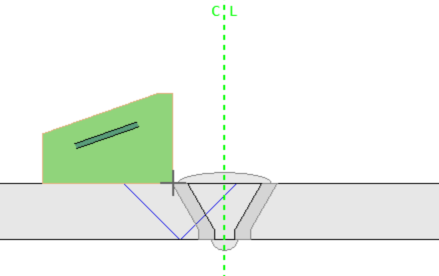{width="400"}

In this example, a weld bead on a 11 mm thick stainless steel plate is manually scanned using a [C540](https://www.olympus-ims.com/en/shop/item/269-productId.570436190_269-catId.0.html) 2.25 MHz single-element angle beam transducer mounted on a ABSA-5T-45 45° wedge. The probe's position is recorded using a wheel encoder.  

**Weld_Plate_UT-sk90.nde** | [:material-download: Download ](https://nde-public-files.s3.ca-central-1.amazonaws.com/4.0/Weld_Plate_UT-sk90.nde) | [:material-eye: View ](https://myhdf5.hdfgroup.org/view?url=https://nde-public-files.s3.ca-central-1.amazonaws.com/4.0/Weld_Plate_UT-sk90.nde)

### Manual Weld Scanning using Phased-Array Ultrasound (PAUT)

{width="400"}

In this first example, a weld bead on a 26 mm thick stainless steel plate is manually scanned using a [5L64-A32](https://www.olympus-ims.com/fr/probes/pa/weld-series/) 5 MHz 64 elements transducer mounted on a SA32-N55S 36° wedge. The probe's position is recorded using a wire encoder. This example comprises a conventional sectorial scanning with one group. 

**Weld_Plate_PA-Sect_sk90.nde** | [:material-download: Download ](https://nde-public-files.s3.ca-central-1.amazonaws.com/4.0/Weld_Plate_PA-Sect_sk90.nde) | [:material-eye: View ](https://myhdf5.hdfgroup.org/view?url=https://nde-public-files.s3.ca-central-1.amazonaws.com/4.0/Weld_Plate_PA-Sect_sk90.nde)

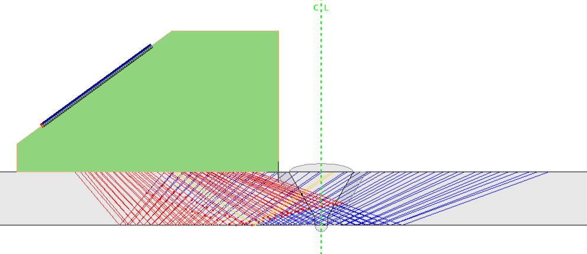{width="400"}

In this second example, a weld bead on a 12.5 mm thick stainless steel plate is manually scanned using a [5L64-A32](https://www.olympus-ims.com/fr/probes/pa/weld-series/) 5 MHz 64 elements transducer mounted on a SA32-N55S 36° wedge. The probe's position is recorded using a wire encoder. This example comprises a compound sectorial scanning with two groups (8 and 16 elements).

**Weld_Plate_PA-Comp_sk90-2gr.nde** | [:material-download: Download ](https://nde-public-files.s3.ca-central-1.amazonaws.com/4.0/Weld_Plate_PA-Comp_sk90-2gr.nde) | [:material-eye: View ](https://myhdf5.hdfgroup.org/view?url=https://nde-public-files.s3.ca-central-1.amazonaws.com/4.0/Weld_Plate_PA-Comp_sk90-2gr.nde)

### Manual Weld Scanning using Total Focusing Method (TFM)

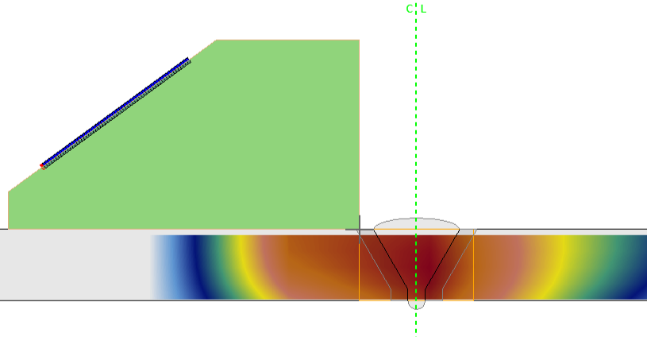{width="400"}

In this example, a weld bead on a 12.5 mm thick stainless steel plate is manually scanned using a [5L64-A32](https://www.olympus-ims.com/fr/probes/pa/weld-series/) 5 MHz 64 elements transducer mounted on a SA32-N55S 36° wedge. The probe's position is recorded using a wire encoder. Two group configurations are provided.

Four TFM Wavesets/Groups: T-T, TT-T, TT-TT, TT-TTT:

**Weld_Plate_4TFM_sk90.nde** | [:material-download: Download ](https://nde-public-files.s3.ca-central-1.amazonaws.com/4.0/Weld_Plate_4TFM_sk90.nde) | [:material-eye: View ](https://myhdf5.hdfgroup.org/view?url=https://nde-public-files.s3.ca-central-1.amazonaws.com/4.0/Weld_Plate_4TFM_sk90.nde)

One PCI Waveset/Group: T-T:

**Weld_Plate_PCI_sk90.nde** | [:material-download: Download ](https://nde-public-files.s3.ca-central-1.amazonaws.com/4.0/Weld_Plate_PCI_sk90.nde) | [:material-eye: View ](https://myhdf5.hdfgroup.org/view?url=https://nde-public-files.s3.ca-central-1.amazonaws.com/4.0/Weld_Plate_PCI_sk90.nde)

### Semiautomated Weld Scanning using Time-of-Flight Diffraction (TOFD) and Phased-Array Ultrasound (PAUT)

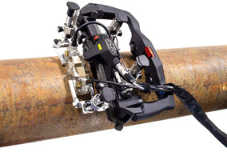{width="250"}
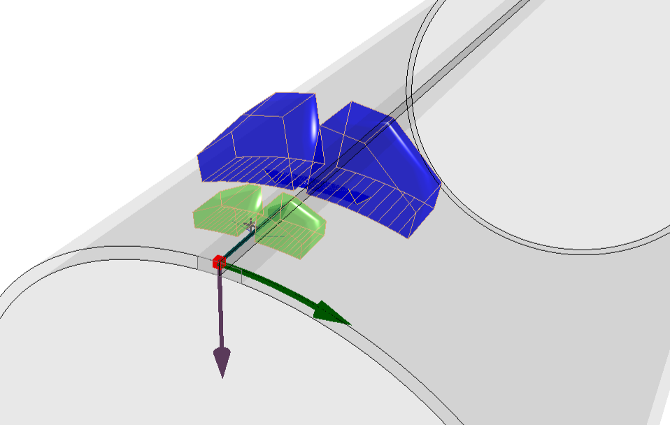{width="300"}

In this example, a 6.15 mm thick steel pipe comprising a longitudinal weld is scanned using the [AxSEAM](https://www.olympus-ims.com/en/scanners/axseam/) scanner and a pair of C563 10 MHz probes mounted on ST1-70L-IHC 70° wedges for TOFD and a pair of 5L32-A31 5 MHz 32 elements transducers mounted on SA31-N55S 36° wedges. The probe's position is recorded using the scanner encoder. 

**Weld_COD_2PA-ToFD.nde** | [:material-download: Download ](https://nde-public-files.s3.ca-central-1.amazonaws.com/4.0/Weld_COD_2PA-ToFD.nde) | [:material-eye: View ](https://myhdf5.hdfgroup.org/view?url=https://nde-public-files.s3.ca-central-1.amazonaws.com/4.0/Weld_COD_2PA-ToFD.nde)

### Girth Weld Scanning using Total Focusing Method (TFM)

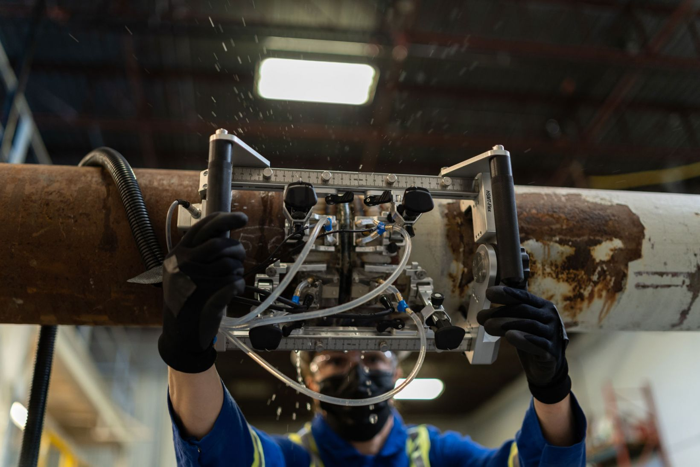{width="250"}
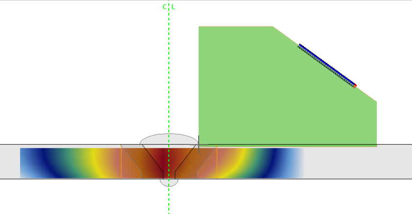{width="300"}

In this example, a 9.5 mm thick steel pipe comprising a circumferential weld is scanned using the [HSMT-Flex](https://www.olympus-ims.com/en/scanners/hsmt-flex/) scanner and a pair of 5L32-A31 5 MHz 32 elements transducers mounted on SA31-N55S 36° wedges. TFM is performed simultaneously from both sides of the weld bead. The probe's position is recorded using the scanner encoder. A post-acquisition analysis was also performed on this file, adding gain to the data. 

**Weld_AOD_DualTFM-Analysis.nde** | [:material-download: Download ](https://nde-public-files.s3.ca-central-1.amazonaws.com/4.0/Weld_AOD_DualTFM-Analysis.nde) | [:material-eye: View ](https://myhdf5.hdfgroup.org/view?url=https://nde-public-files.s3.ca-central-1.amazonaws.com/4.0/Weld_AOD_DualTFM-Analysis.nde)

## [General Mapping](../../json-metadata/setup/data-model/scenarios.md#general-mapping-scenario) Scenario Examples

### Composite Wheel Probe Scanning using Phased-Array Ultrasound (PAUT) 

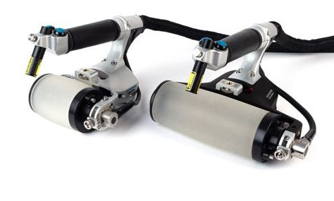{width="250"}
{width="400"}

In this example, a 10 mm thick plexiglass plate comprising engraved letters is scanned using the [RollerFORM](https://www.olympus-ims.com/en/rollerform/) scanner and a 3.5L64-IWP1 3.5 MHz 64 elements transducer, mimicking the inspection of a Carbon Fiber Reinforced Polymer (CFRP) plate. The probe's position is recorded using the scanner encoder. A post-acquisition analysis was also performed on this file, adding gain to the data. 

Using Phased-Array Ultrasound (PAUT):

**CFRP_Plate_PA-Lin0_sk90-Analysis.nde** | [:material-download: Download ](https://nde-public-files.s3.ca-central-1.amazonaws.com/4.0/CFRP_Plate_PA-Lin0_sk90-Analysis.nde) | [:material-eye: View ](https://myhdf5.hdfgroup.org/view?url=https://nde-public-files.s3.ca-central-1.amazonaws.com/4.0/CFRP_Plate_PA-Lin0_sk90-Analysis.nde)

### Composite X-Y Scanning using Total Focusing Method (TFM) 

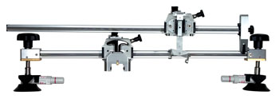{width="250"}
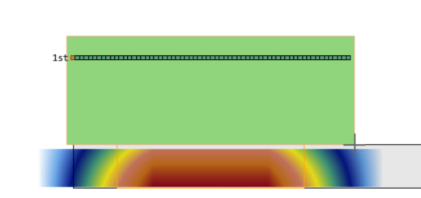{width="400"}

In this example, a 10 mm thick plexiglass plate comprising engraved letters is scanned using the [Glider](https://www.olympus-ims.com/am/scanners/glider-scanner/) scanner and a 5L64-NW1 5 MHz 64 elements transducer mounted on a SNW1-0L 0° wedge, mimicking the inspection of a Carbon Fiber Reinforced Polymer (CFRP) plate. The probe's position is recorded using the scanner encoder. Two group configurations are provided.

Using Total Focusing Method (TFM):

**CFRP_Plate_TFM-Raster_sk90.nde** | [:material-download: Download ](https://nde-public-files.s3.ca-central-1.amazonaws.com/4.0/CFRP_Plate_TFM-Raster_sk90.nde) | [:material-eye: View ](https://myhdf5.hdfgroup.org/view?url=https://nde-public-files.s3.ca-central-1.amazonaws.com/4.0/CFRP_Plate_TFM-Raster_sk90.nde)

Using Phase Coherence Imaging (PCI):

**CFRP_Plate_PCI-Raster_sk90.nde** | [:material-download: Download ](https://nde-public-files.s3.ca-central-1.amazonaws.com/4.0/CFRP_Plate_PCI-Raster_sk90.nde) | [:material-eye: View ](https://myhdf5.hdfgroup.org/view?url=https://nde-public-files.s3.ca-central-1.amazonaws.com/4.0/CFRP_Plate_PCI-Raster_sk90.nde)

### Corrosion Inspection using Phased-Array Ultrasound (PAUT)

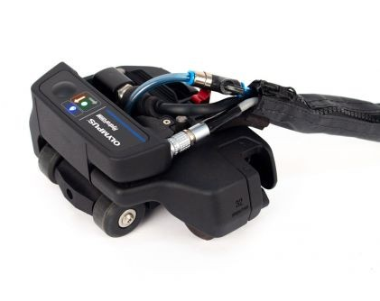{width="250"}
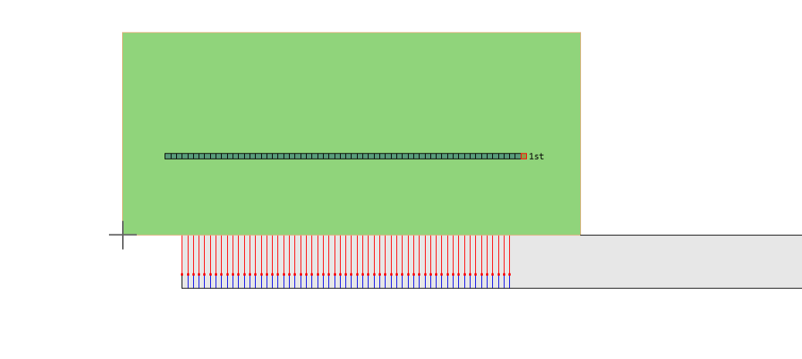{width="400"}

In this example, a 9.5 mm thick steel plate is scanned using the [HydroFORM](https://www.olympus-ims.com/en/corrosion-solutions/hydroform/) scanner and a 7.5L64-I8 7.5 MHz 64 elements transducer. The probe's position is recorded using the scanner encoder.

**Corr_Plate_PA-Lin0_sk270.nde** | [:material-download: Download ](https://nde-public-files.s3.ca-central-1.amazonaws.com/4.0/Corr_Plate_PA-Lin0_sk270.nde) | [:material-eye: View ](https://myhdf5.hdfgroup.org/view?url=https://nde-public-files.s3.ca-central-1.amazonaws.com/4.0/Corr_Plate_PA-Lin0_sk270.nde)

### Pipes Elbow Corrosion Inspection using Phased-Array Ultrasound (PAUT)

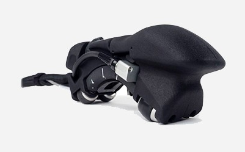{width="250"}
{width="400"}

In this example, a 5.5 mm thick elbow pipe is scanned using the [FlexoFORM](https://www.olympus-ims.com/en/scanners/flexoform/) scanner and a 7.5L64-FA1 7.5 MHz 64 elements transducer. The probe's position is recorded using the scanner encoder. Note that in this case a plate geometry is being used, as each element of the probe is maintained normal to the pipe surface for each scanner position. A post-acquisition analysis was also performed on this file, adding gain to the data. 

**Corr_COD_PA-Lin0_sk90-Analysis.nde** | [:material-download: Download ](https://nde-public-files.s3.ca-central-1.amazonaws.com/4.0/Corr_COD_PA-Lin0_sk90-Analysis.nde) | [:material-eye: View ](https://myhdf5.hdfgroup.org/view?url=https://nde-public-files.s3.ca-central-1.amazonaws.com/4.0/Corr_COD_PA-Lin0_sk90-Analysis.nde)

### Full Matrix Capture (FMC) Acquisition

In this example, a 7.5L60-PWZ1 7.5 MHz 60 elements transducer is positioned in contact with a steel block comprising side drilled holes. The probe's position is fixed. A single FMC is collected.

**fmc.nde** | [:material-download: Download ](https://nde-public-files.s3.ca-central-1.amazonaws.com/4.0/fmc.nde) | [:material-eye: View ](https://myhdf5.hdfgroup.org/view?url=https://nde-public-files.s3.ca-central-1.amazonaws.com/4.0/fmc.nde)

