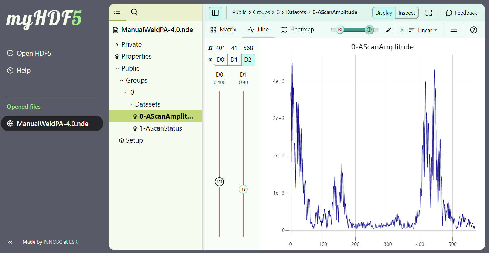

The [HDF5 library](https://www.hdfgroup.org/) serves as the backbone of the NDE file format. The .nde format uses the HDF5 library along with the data model defined in this documentation to provide a consistent, flexible, and powerful format for the NDT industry. 

As the .nde format inherits the **hierarchical** characteristic of the HDF5 framework, its data model can be represented as a **tree structure** similar to a file system structure with folders and files. Within the HDF5 framework, folders are called **groups** and files are called **datasets**.

Each .nde file should follow this basic structure: 

!!! tip inline end

    Click on the **Private**, **Public**, **Setup**, **Groups**, or **Properties** blocks to learn more. 

``` mermaid
flowchart LR
  .nde[**.nde**]:::root --> Private["/Private"]:::group
  .nde[**.nde**]:::root --> Public["/Public `required`"]:::group
  .nde[**.nde**]:::root --> Properties["/Properties*"]:::dataset
  Public["/Public*"] --> Setup["/Setup*"]:::dataset
  Public["/Public*"] --> Groups["/Groups"]:::group
  .nde@{ shape: text}
  click Public "public-group"
  click Private "private-group"
  click Properties "../json-metadata/properties"
  click Setup "../json-metadata/setup"
  click Groups "public-group#groups-group-and-subgroups"
  classDef root fill:#fff
  classDef group fill:#ffc72c,stroke:#000000,color:#000000
  classDef dataset fill:#fff,stroke:#000000,color:#000000
```

Each of the structure layers represents either an HDF5 [group](https://support.hdfgroup.org/documentation/hdf5/latest/_h5_d_m__u_g.html#subsubsec_data_model_abstract_group)  (yellow rectangle) or a [dataset](https://support.hdfgroup.org/documentation/hdf5/latest/_h5_d_m__u_g.html#subsubsec_data_model_abstract_dataset)  (white rectangle). Mandatory groups and datasets are highlighted by a `*` at the end of their name. 

Any .nde file can be opened using a regular HDF5 reader such as [HDFView](https://www.hdfgroup.org/downloads/hdfview/) or [MyHDF5](https://myhdf5.hdfgroup.org/), allowing you to explore its structure and get a glance at its content. Learn more by exploring some of our [example files](../examples/example-files/index.md).

