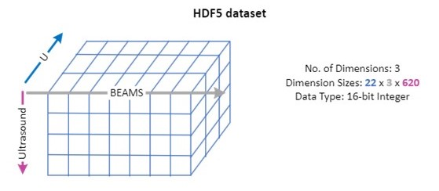
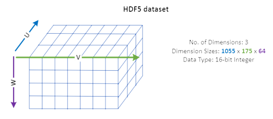

# Datasets related arrays and objects

A dataset is a container for data of homogeneous nature, characterized by standardized data classes, with its volume potentially necessitating storage within the HDF5 structure. It can exist even if data are not yet created or available. Through the process it originates, it establishes a connection between the data and physical reality (time/space). 

## **datasets** array

The **datasets** array describes dataset(s).

| Property                  | Type    | Description                                                                                                                   |
| :------------------------ | :------ | :---------------------------------------------------------------------------------------------------------------------------- |
| **id**                    | integer | The unique dataset id within the group                                                                                        |
| **name**                  | string  | The name of the dataset                                                                                                       |
| **storageMode**           | string  | One of `Independent` or `Paintbrush`                                                                                          |
| **dataTransformations**   | array   | A [dataTransformations](#datatransformations-array) object describing how to display the dataset                              |
| **path**                  | string  | The path to the dataset in the HDF5 structure                                                                                 |
| **dataClass**             | string  | One of `AScanAmplitude`, `AScanStatus`, `TfmValue`, `TfmStatus`, `FiringSource`, `CScanPeak`, `CScanStatus`, `CScanTime`      |
| **dataValue** `required`  | object  | A [dataValue](#datavalue-object) object                                                                                       |
| **dimensions** `required` | array   | One of the following array configuration: [`UCoordinate`, `VCoordinate`, `Ultrasound`], [`UCoordinate`, `Beam`, `Ultrasound`] |

### **dataTransformations** array

| Property                 | Type    | Description                                                                      |
| :----------------------- | :------ | :------------------------------------------------------------------------------- |
| **processId** `required` | integer | The processId of the last process in the chain                                   |
| **groupId**              | integer | The groupId of the last process in the chain (not required if in the same group) |

### **dataValue** object

The **dataValue** object describes the range of values a dataset can take. 

| Property               | Type    | Description                                                     |
| :--------------------- | :------ | :-------------------------------------------------------------- |
| **min** `required`     | number  | Minimum value possible of the dataset                           |
| **max** `required`     | number  | Maximum value possible of the dataset                           |
| **unitMin** `required` | integer | Minimum value possible of the dataset in the corresponding unit |
| **unitMax** `required` | integer | Maximum value possible of the dataset in the corresponding unit |
| **unit** `required`    | string  | One of: `Percent`                                               |

To map a value from the range [min, max] to [unitMin, unitMax], use the following formula:

$$ 
x_{scaled}= \left( \frac{x - \text{min}}{\text{max} - \text{min}} \right) \times (\text{unitMax} - \text{unitMin}) + \text{unitMin} 
$$

### **dimensions** array 

The **dimensions** array describes the different dimensions (axes) of the dataset(s).

| Property                  | Type    |  Unit  | Description                                                                      |
| :------------------------ | :------ | :----: | :------------------------------------------------------------------------------- |
| **axis** `required`       | string  |   -    | One of `UCoordinate`, `VCoordinate`, `WCoordinate`, `Ultrasound`, `stackedAScan` |
| **offset**                | number  | m or s | Offset to position the dataset                                                   |
| **quantity** `required`   | integer |   -    | Size of the dataset against this axis (dimension)                                |
| **resolution** `required` | number  | m or s | Resolution of the dataset against this axis (dimension)                          |

**Dimensions are always given in the same order as the HDF5 data has been created.**

These dimensions can vary depending on the the group and scan types.

## Datasets dimensions for typical use cases

### Phased Array One Line Scan



```json
"dimensions": [
  {
    "axis": "UCoordinate",
    "quantity": 22,
    "resolution": 0.001
  },
  {
    "axis": "Beam",
    "beams": [
      {
        "velocity": 3240.0,
        "skewAngle": 90.0,
        "refractedAngle": 45.0,
        "uCoordinateOffset": 0.004,
        "vCoordinateOffset": -0.069689058139837418,
        "ultrasoundOffset": 0.0
      },
      {
        "velocity": 3240.0,
        "skewAngle": 90.0,
        "refractedAngle": 45.0,
        "uCoordinateOffset": 0.004,
        "vCoordinateOffset": -0.069111085619919382,
        "ultrasoundOffset": 0.0
      },
      {
        "velocity": 3240.0,
        "skewAngle": 90.0,
        "refractedAngle": 45.0,
        "uCoordinateOffset": 0.004,
        "vCoordinateOffset": -0.068533113100001347,
        "ultrasoundOffset": 0.0
      }
    ]
  },
  {
    "axis": "Ultrasound",
    "quantity": 620,
    "resolution": 1.3E-07
  }
]
```

### Phased Array Zero Degree Raster


```json
"dimensions": [
  {
    "axis": "UCoordinate",
    "offset": 0.0,
    "quantity": 351,
    "resolution": 0.001
  },
  {
    "axis": "VCoordinate",
    "offset": -0.07455,
    "quantity": 114,
    "resolution": 0.001
  },
  {
    "axis": "Ultrasound",
    "offset": 0.0,
    "quantity": 568,
    "resolution": 2E-08
  }
]
```

### TFM



```json
"dimensions": [
    {
      "axis": "UCoordinate",
      "offset": 0.0,
      "quantity": 1055,
      "resolution": 0.001
    },
    {
      "axis": "VCoordinate",
      "offset": -0.012969999999999999,
      "quantity": 175,
      "resolution": 0.00015120689655172411
    },
    {
      "axis": "WCoordinate",
      "offset": 0.0,
      "quantity": 64,
      "resolution": 0.00015111111111111111
    }
]
```

### FMC


```json
"dimensions": [
    {
      "axis": "UCoordinate",
      "quantity": 1,
      "resolution": 0.001,
      "offset": 0.0
    },
    {
      "axis": "StackedAScan",
      "quantity": 8192000,
      "resolution": 1e-08
    }
]
```