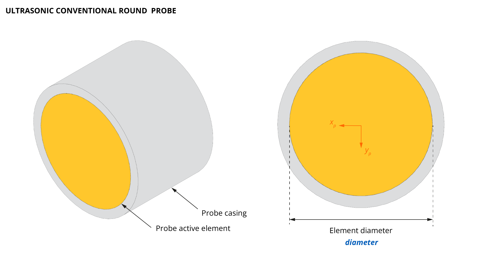
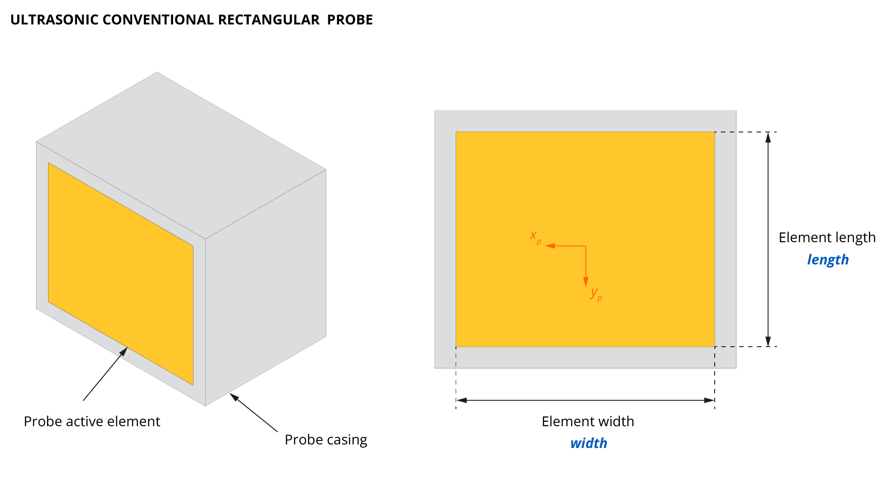
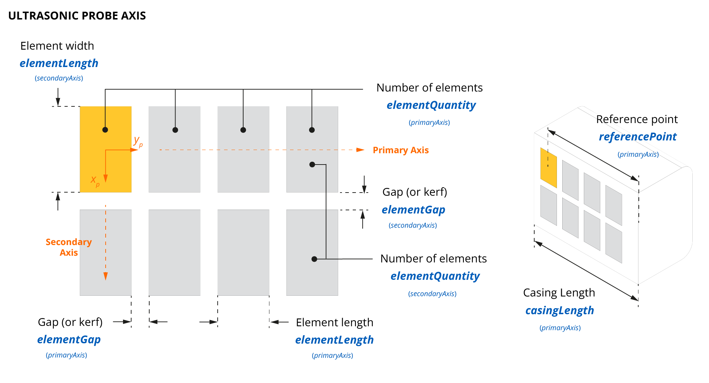

#Probes related arrays and objects

Ultrasonic **probes** are transducers that generate and receive high-frequency sound waves to inspect materials for internal flaws, thickness measurements, or material characterization.

## **probes** array

The **probes** array describes a generic probe comprising a list of properties.

<table>
<thead>
  <tr>
    <th>Property</th>
    <th>Type</th>
    <th>Description</th>
  </tr>
</thead>
<tbody>
  <tr>
    <td><b>id</b>  <code>required</code></td>
    <td>integer</td>
    <td>The unique probe id in the JSON structure</td>
  </tr>
  <tr>
    <td><b>model</b></td>
    <td>string</td>
    <td>The probe model reference</td>
  </tr>
  <tr>
    <td><b>serie</b></td>
    <td>string</td>
    <td>The probe serie reference</td>
  </tr>
  <tr>
    <td><b>serialNumber</b></td>
    <td>string</td>
    <td>The probe serial number</td>
  </tr>
  <tr>
    <td><b>wedgeAssociation</b></td>
    <td>object</td>
    <td>A <a href="#wedgeassociation-object">wedgeAssociation</a> object</td>
  </tr>
  <tr>
    <td>One of the following <code>required</code> sub-object: 
        <ul>
            <li><b><a href="#conventionalround-object">conventionalRound</a></b></li>
            <li><b><a href="#conventionalrectangular-object">conventionalRectangular</a></b></li>
            <li><b><a href="#phasedarraylinear-object">phasedArrayLinear</a></b></li>
        </ul> 
    </td>
    <td>object</td>
    <td></td>
  </tr>
</tbody>
</table>


### **conventionalRound** object

The **conventionalRound** object describes a conventional single-element ultrasonic probe having a round shape. 


| Property                        | Type   | Unit | Description                                                          |
| :------------------------------ | :----- | :--: | :------------------------------------------------------------------- |
| **centralFrequency** `required` | number |  Hz  | The central frequency of the probe                                   |
| **diameter** `required`         | number |  m   | The diameter of the probe probe active element                       |
| **elements** `required`         | array  |  -   | An [elements](#elements-array) array (only one element in this case) |



```json title="Example"
"conventionalRound": {
  "centralFrequency": 5000000.0,
  "diameter": 0.00635,
  "elements": [
    {
      "id": 0,
      "acquisitionUnitId": 0,
      "connectorName": "P1"
    }
  ]
}
```

### **conventionalRectangular** object

The **conventionalRectangular** object describes a conventional single-element ultrasonic probe having a rectangular shape. 

| Property                        | Type   | Unit | Description                                                          |
| :------------------------------ | :----- | :--: | :------------------------------------------------------------------- |
| **centralFrequency** `required` | number |  Hz  | The central frequency of the probe                                   |
| **length** `required`           | number |  m   | The length of the probe active element                               |
| **width** `required`            | number |  m   | The width of the probe active element                                |
| **elements** `required`         | array  |  -   | An [elements](#elements-array) array (only one element in this case) |



```json title="Example"
"conventionalRectangular": {
  "length": 0.02,
  "width": 0.01,
  "centralFrequency": 10000000.0,
  "elements": [
    {
      "id": 0,
      "acquisitionUnitId": 0,
      "connectorName": "P1"
    }
  ]
}
```

### **phasedArrayLinear** object 

The **phasedArrayLinear** object describes a phased array ultrasonic probe having a linear shape. 

| Property                        | Type   | Unit | Description                                                                                          |
| :------------------------------ | :----- | :--: | :--------------------------------------------------------------------------------------------------- |
| **centralFrequency** `required` | number |  Hz  | The central frequency of all elements of the probe                                                   |
| **elements**                    | array  |  -   | An [elements](#elements-array) array                                                          |
| **primaryAxis** `required`      | object |  -   | A [probeAxis](#probeaxis-object) object describing the primary axis of the phased array linear probe |
| **secondaryAxis** `required`    | object |  -   | A [probeAxis](#probeaxis-object) objectdescribing the primary axis of the phased array linear probe  |

Currently, the following use cases are covered by the phasedArrayLinear object definition:

  - 1D linear array with flat active face. 
  - 1D linear array with curved active face along the primary axis.
  - 1D linear array with curved active face along the secondary axis.
  - 2D linear array with flat active face. 
  - 2D linear array with curved active face along the primary axis.
  - 2D linear array with curved active face along the secondary axis.

#### **elements** array

The **elements** array lists the elements of a probe and there properties. 

| Property                         |  Type   | Description                                                                               |
| :------------------------------- | :-----: | :---------------------------------------------------------------------------------------- |
| **id** `required`                | integer | The unique id of the probe element                                                        |
| **pinId** `required`             | integer | The pin id to which the element is connected                                              |
| **acquisitionUnitId** `required` | integer | The unique id of the acquisition unit to which the element of the probe is connected      |
| **connectorName** `required`     | string  | The name of the connector used to interface between each element and the acquisition unit |
| **primaryIndex**                 | integer | Element numbering against the probe primary axis                                          |
| **secondaryIndex**               | integer | Element numbering against the probe secondary axis                                        |
| **enable**                       | boolean | Whether the element is activated or not                                                   |

**Related objects**: [acquisitionUnits](../data-model/acquisition-units.md)

#### **probeAxis** object

Teh **probeAxis** object describes a given probe axis. 

Illustration

| Property                       | Type    | Unit | Description                                                                                              |
| :----------------------------- | :------ | :--: | :------------------------------------------------------------------------------------------------------- |
| **elementGap** `required`      | number  |  m   | The spacing between two adjacent elements                                                                |
| **elementQuantity** `required` | integer |  -   | The number of elements in the array along this axis                                                      |
| **elementLength** `required`   | number  |  m   | The length of a single element of the array where all elements have the same length along this axis      |
| **referencePoint** `required`  | number  |  -   | The distance between the casing embedding the array and the center of the first element  along this axis |
| **casingLength**               | number  |  m   | The length of the casing embedding the array along this axis                                             |

Hypothesis:

  - Constant **elementLength** and **elementGap** for **elementQuantity** distributed along the probe primary axis. 
  - Constant **elementLength** and **elementGap** for **elementQuantity** distributed along the probe secondary axis. 
  - Probe surface may be curved along the first or secondary probe axis but not both.



```json title="Example"
"phasedArrayLinear": {
  "centralFrequency": 5000000.0,
  "elements": [
    {
      "id": 0,
      "pinId": 0,
      "acquisitionUnitId": 0,
      "connectorName": "PA",
      "primaryIndex": 0,
      "secondaryIndex": 0,
      "enabled": true
    },
    {
      "id": 1,
      "pinId": 1,
      "acquisitionUnitId": 0,
      "connectorName": "PA",
      "primaryIndex": 1,
      "secondaryIndex": 0,
      "enabled": true
    },
    {...}
  ],
  "primaryAxis": {
    "elementGap": 0.0,
    "elementQuantity": 64,
    "elementLength": 0.0005,
    "referencePoint": -0.0366,
    "casingLength": 0.04
  },
  "secondaryAxis": {
    "elementGap": 0.0,
    "elementQuantity": 1,
    "elementLength": 0.01,
    "referencePoint": 0.0,
    "casingLength": 2E-06
  }
}
```

### **wedgeAssociation** object

The **wedgeAssociation** object describes the association of a probe with a wedge. 


| Property                          | Type    | Description                                              |
| :-------------------------------- | :------ | :------------------------------------------------------- |
| **wedgeId** `required`            | integer | The associated wedge Id                                  |
| **mountingLocationId** `required` | integer | The associated mounting location Id                      |
| **orientation**                   | string  | Probe mounting orientation, one of `Normal` or `Reverse` |

**Related objects**: [wedges](../data-model/wedges.md), [mountingLocations](../data-model/wedges.md#mountinglocations-array)

```json title="Example"
"wedgeAssociation": {
  "wedgeId": 0,
  "mountingLocationId": 0,
  "orientation": "Normal"
}
```

## Examples

Examples of Phased Array and Single/Dual Element probes definitions extracted from Evident catalogue. 

??? example "Phased Array Probes Examples"

    === "5L64-A32"
        ``` json
        --8<-- "docs/assets/json/json-metadata/setup/data-model/probes-5L64-A32.json"
        ``` 
    === "10CCEV35-32-A15"
        ``` json
        --8<-- "docs/assets/json/json-metadata/setup/data-model/probes-10CCEV35-32-A15.json"
        ```
    === "7.5L64-I4"
        ``` json
        --8<-- "docs/assets/json/json-metadata/setup/data-model/probes-7.5L64-I4.json"
        ``` 
    === "7.5L60-PWZ1"
        ``` json
        --8<-- "docs/assets/json/json-metadata/setup/data-model/probes-7.5L60-PWZ1.json"
        ``` 
    === "5DL32-32X12-A26"
        ``` json
        --8<-- "docs/assets/json/json-metadata/setup/data-model/probes-5DL32-32X12-A26.json"
        ```
    === "4DM16X2SM-16X6-A27"
        ``` json
        --8<-- "docs/assets/json/json-metadata/setup/data-model/probes-4DM16X2SM-16X6-A27.json"
        ```
    === "2L8-DGS1"
        ``` json
        --8<-- "docs/assets/json/json-metadata/setup/data-model/probes-2L8-DGS1.json"
        ```

??? example "Single and Dual Element Probes Examples"

    === "V103"
        ``` json
        --8<-- "docs/assets/json/json-metadata/setup/data-model/probes-V103.json"
        ``` 
    === "10CCEV35-32-A15"
        ``` json
        --8<-- "docs/assets/json/json-metadata/setup/data-model/probes-D713.json"
        ```


    
