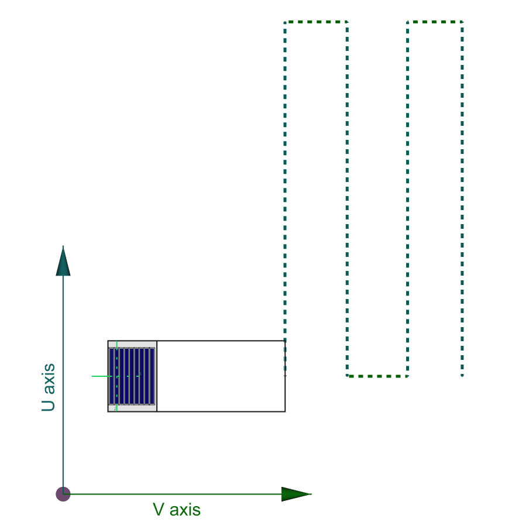
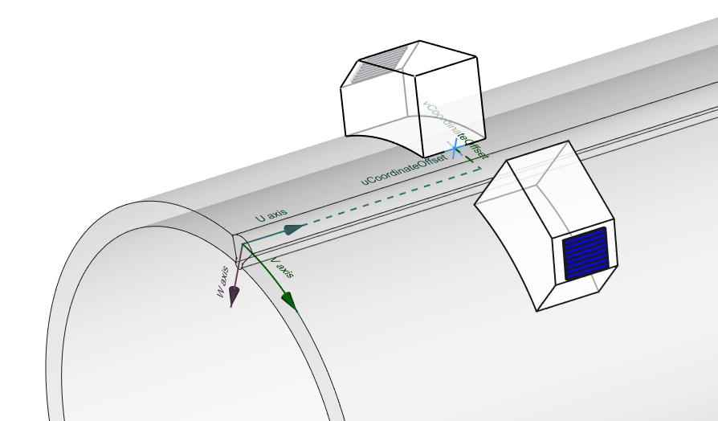
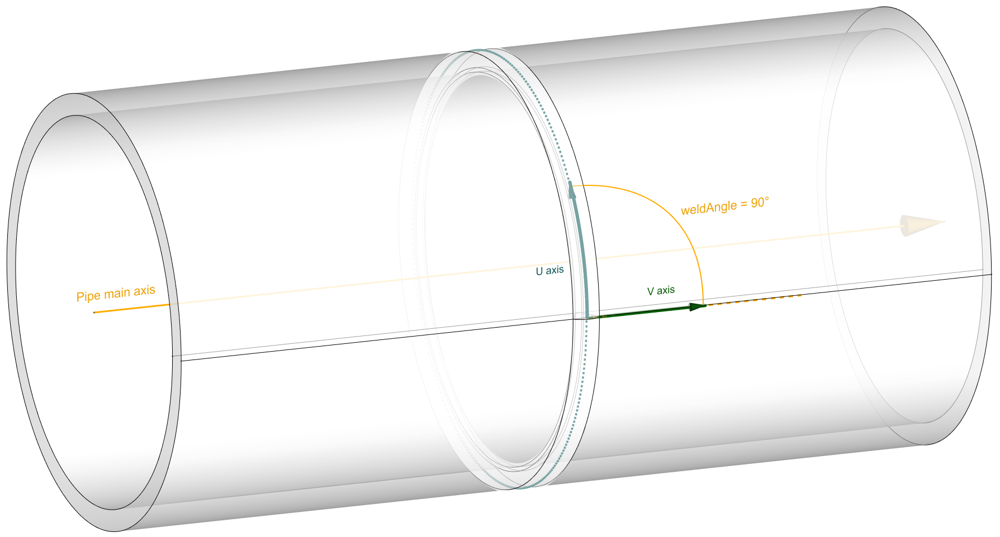

# Scenarios

Scenarios introduce a set of conventions specific to a given use case, enabling a simple description of the specimen and associated probe and wedge positioning. 

Many nondestructive inspection scan plans are referenced to the surface of a specimen. Scenarios corresponding to these use cases link the probe or wedge positioning through $(U,V)$ surface coordinates. 

## **General Mapping** scenario

Hypotheses:

  - The probe positioning vs. the related specimen surface is constant for all $(u,v)$ position (skew angle, liftoff, etc.) or automatically compensated (i.e., adaptive acoustic, liftoff compensation, electronic).
  - The $u$ axis is the principal scan axis and is typically collinear with a physical encoder device.
  - The $v$ axis is orthogonal to the $u$ axis and may be associated to a secondary physical encoder, an electronic scan, or both (for paint brush raster scans).
  - The origin $O$ position on the surface is arbitrarily defined by the user.

| {width="40%"} |
|:---------------------------------------------------------------------------------------------------------------------:|
| *Raster example with the $U$ and $V$ axis.*                                                                |

## **General Weld** scenario

Hypotheses:

  - The scenario relates to the inspection of a single straight or curved weld or joint.
  - The surface line $(u,0)$ is collinear with the center of said weld or joint.
  - The probe positioning vs. the related specimen surface is constant for all $(u,v)$ position (skew angle, liftoff, etc.) or automatically compensated (i.e., adaptive acoustic, liftoff compensation, electronic).
  -  For pipe geometry, the orientation of the weld is defined in relation to the pipe axis. With an angle of 0° for an axial weld and 90° for a circumferential one. Any angle in between describes a helical weld.
  -  Scan patterns can be entirely described on the surface of specimen as a set of orthogonal axes parallel and orthogonal to the weld.

| {width="50%"} |
|:-------------------------------------------------------------------------------------------------------------------------------:|
| *Example general weld scenario with an axial weld on a pipe.*                                                        |

| {width="70%"} |
| :-----------------------------------------------------------------------------------------------------------------------------------------------: |
|                                       *Axial weld: The weld angle is defined in relation to the pipe axis.*                                       |

| {width="70%"} |
| :---------------------------------------------------------------------------------------------------------------------------------------------: |
|                                      *Girth weld: The weld angle is defined in relation to the pipe axis.*                                      |
